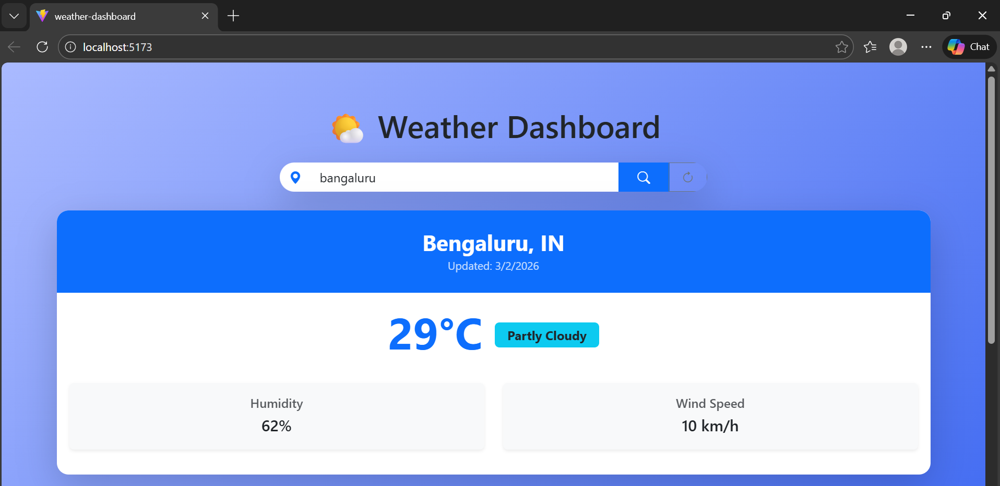
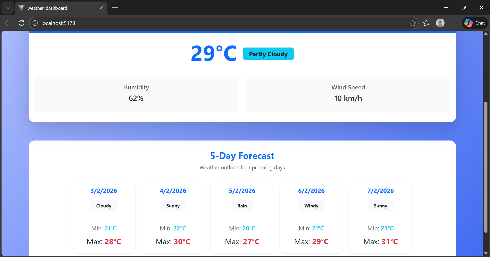

# 🌤 Weather Dashboard App




A modern Weather Dashboard built using Vue 3, Pinia, and Bootstrap.
This app displays current weather information and a 5-day forecast.

---

## 🚀 Features

- 🔍 Search weather by city
- 🌡 Display current temperature
- 💧 Humidity and wind speed
- 📅 5-Day forecast
- ⚡ Loading spinner while fetching data
- ❌ Error handling alerts
- 🎨 Modern responsive UI
- 📱 Mobile friendly design

---

## 🛠 Tech Stack

- Vue 3 (Composition API)
- Pinia (State Management)
- Bootstrap 5
- Vite (Build Tool)
- JSON API / Weather API

---

## 📂 Project Structure


---

## ⚙️ Installation

### 1️⃣ Clone the repository

```bash
git clone https://github.com/your-username/weather-dashboard.git
cd weather-dashboard
```
npm install
npm install
npm install

store/weatherStore.js
